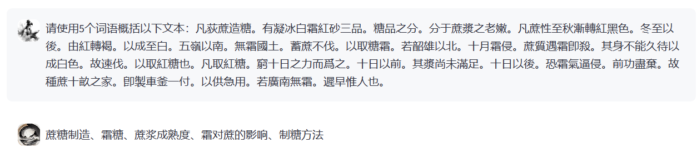
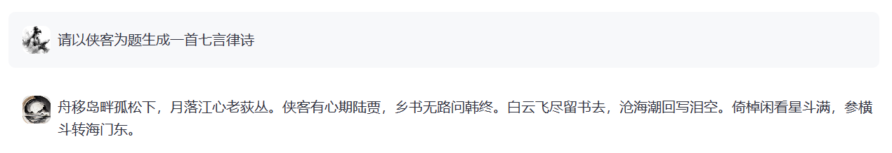
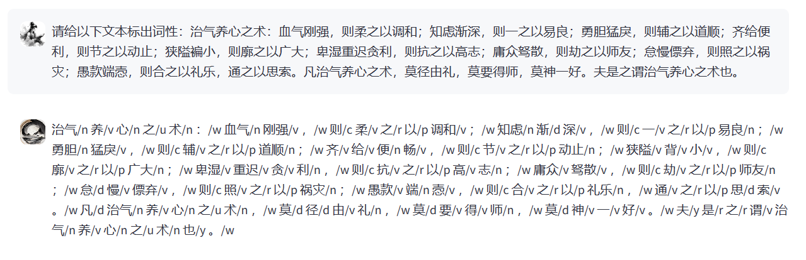
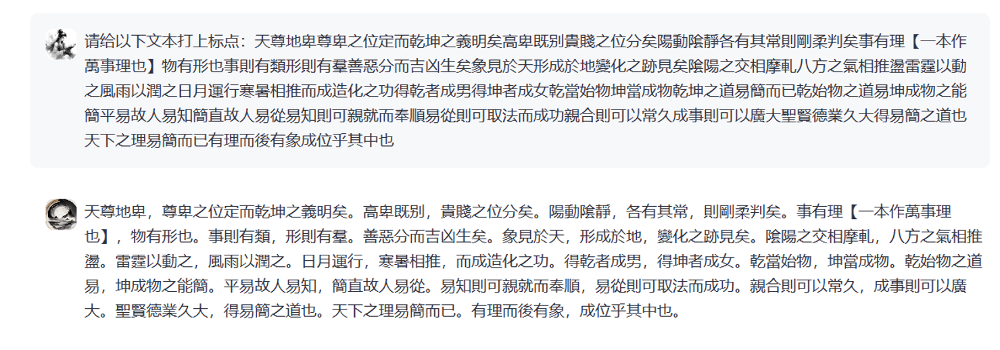

<p align="left">
    中文&nbsp ｜ &nbsp<a href="./README_en.md">English</a>
</p>
<div align="center">
  
</div>

# 荀子系列大语言模型

本次荀子系列模型开源包括两个部分：基座模型**XunziALLM**，作为本次模型开源的重点，本项目推出了完全开放使用的古籍领域大模型，与此同时，为方便非人工智能领域人员更好地了解本次开源模型，我们使用一部分数据构建了对话模型**XunziChat**,用户可使用与调用千问、Baichuan2、ChatGLM3 、Qwen1.5等对应开源模型一致方法调用我们的古籍处理模型。

当前已发布的古籍大模型:

| 模型名称                       | 下载链接                                                     |对应开源模型          |
| :----------------------------- | :----------------------------------------------------------- | :----------------|
|Xunzi-Qwen-7B（基座模型）    | [链接](https://modelscope.cn/models/Xunzillm4cc/Xunzi-Qwen) |Qwen-7B基座模型（版本v1.0.5）|
|Xunzi-Qwen-7B-CHAT（对话模型）  | [链接](https://modelscope.cn/models/Xunzillm4cc/Xunzi-Qwen-Chat) |Qwen-7B对话模型|
|Xunzi-GLM-6B（基座模型）  | [链接](https://modelscope.cn/models/Xunzillm4cc/Xunzi-GLM) |ChatGLM3-6B基座模型|
|Xunzi-Baichuan-7B（基座模型）  | [链接](https://modelscope.cn/models/Xunzillm4cc/Xunzi-Baichuan) |Baichuan2-7B基座模型|
|Xunzi-Qwen1.5-4B（基座模型）  | [链接](https://www.modelscope.cn/models/Xunzillm4cc/Xunzi-Qwen1.5-4B) |Xunzi-Qwen1.5-4B基座模型|
|Xunzi-Qwen1.5-7B（基座模型）  | [链接](https://www.modelscope.cn/models/Xunzillm4cc/Xunzi-Qwen1.5-7B) |Xunzi-Qwen1.5-7B基座模型|
|Xunzi-Qwen1.5-14B（基座模型）  | [链接](https://www.modelscope.cn/models/Xunzillm4cc/Xunzi-Qwen1.5-14B) |Xunzi-Qwen1.5-14B基座模型|
|Xunzi-Qwen1.5-7B_chat（对话模型）  | [链接](https://www.modelscope.cn/models/Xunzillm4cc/Xunzi-Qwen1.5-7B_chat) |Xunzi-Qwen1.5-7B_chat对话模型(推荐对话使用)|
|Xunzi-Qwen2-7B（基座模型）  | [链接](https://www.modelscope.cn/models/Xunzillm4cc/Xunzi-Qwen2-7B) |Xunzi-Qwen2-7B基座模型|
|Xunzi-Qwen2-1.5B（基座模型）  | [链接](https://www.modelscope.cn/models/Xunzillm4cc/Xunzi-Qwen2-1.5B) |Xunzi-Qwen2-1.5B基座模型|

Xunzi-Qwen-7B与Xunzi-Qwen-7B-CHAT调用方式与Qwen模型相同。

Xunzi-GLM-6B调用方式与ChatGLM3-6B模型相同。

Xunzi-Baichuan-7B调用方式与Baichuan2-7B模型相同。

Xunzi-Qwen1.5-7B，Xunzi-Qwen1.5-14B，Xunzi-Qwen1.5-4B与Xunzi-Qwen1.5-7B_chat的调用方式与Qwen1.5模型相同。

Xunzi-Qwen2-7B与Xunzi-Qwen2-1.5B的调用方式与Qwen2模型相同。

## 新闻 
- 2024/5/20 Xunzi-Qwen1.5-7B_chat模型对话API免费开放。用户可通过openai库直接调用Xunzi-Qwen1.5-7B_chat模型实现对话服务。新版本对话模型加强了信息抽取、文本翻译、多轮对话等一系列功能。
- 2024/5/6 更新github项目开源模型列表。

## 荀子系列模型亮点：

* 古籍智能标引，荀子模型具备强大的古籍文献标引能力，能够对古籍中的内容进行高质量主题标引，帮助研究人员快速了解文章主题。


* 古籍信息抽取，荀子模型能够自动从古籍中抽取关键信息，如人物、事件、地点等，大大节省了研究人员的信息整理时间。


* 诗歌生成：荀子模型还具备诗歌生成的能力，能够根据给定的主题或关键词，自动生成符合语法规则和韵律要求的古诗，为诗词爱好者提供创作灵感。


* 古籍高质量翻译：对于那些难以理解的古籍文献，荀子模型能够提供高质量的翻译服务，帮助研究人员更好地理解原文含义。


* 阅读理解：荀子模型能够对给出的古文文本进行分析解释，实现对古籍文本的自动阅读。


* 词法分析：荀子模型可以完成古籍文本的自动分词和词性标注，能够有效提升语言学工作者的研究效率。


* 自动标点：荀子大模型可以快速完成古籍文本的断句和标点，提升研究者以及业余爱好者对古籍文本的阅读体验。



由于我们同时发布了基座模型，用户也可以根据自己的需求，使用本地的训练语料微调荀子基座模型，使得其能够在古籍下游处理任务上取得更佳的处理性能。

## API调用

使用第三方python库openai，调用Xunzi-Qwen1.5-7B_chat实现对话。

```python
from openai import OpenAI
from tqdm import tqdm
openai_api_key = "ANY THING"
openai_api_base = "http://xunziallm.njau.edu.cn:21180/v1"
client = OpenAI(
    api_key=openai_api_key,
    base_url=openai_api_base,
)

for i in tqdm(range(0,1)):
    chat_response = client.chat.completions.create(
        model="/home/gpu0/xunzi_web/Xunzi-Qwen1.5-7B_chat",
        messages=[
            {"role": "system", "content": "You are a helpful assistant."},
            {"role": "user", "content": '根据提供的文本，按照关系scheme组合(人物, PO/官職, 官職),(人物, PP/態度傾向/消極, 人物),(人物, PL/其他, 地点),(人物, PL/居, 地点),(人物代词, 態度傾向/消極, 人物)抽取出符合描述的关系三元组\n奏上，上令公卿列侯宗室集議，莫敢難，獨竇嬰爭之，由此與錯有卻。'},
        ]
    )
    print(chat_response.choices[0].message.content)
```


## 声明：

荀子系列大语言模型在处理中华古籍文本信息方面表现出了不错的性能，不仅能够准确剖析古籍文本的复杂性，还可以进一步挖掘中国传统文化的丰富内涵。然而，我们也清楚地认识到，本模型仍有许多需要改进和优化的地方。因此，我们非常欢迎和鼓励用户对我们的模型提出宝贵的意见和建议，并且在后续工作中，我们会推出具有更好性能的新版本大语言模型。

大语言模型庞大的参数量也带来了更多的随机性，虽然我们在训练数据选取时已经尽可能保证了数据的合规性，但由于数据和模型的复杂性，仍有可能存在一些无法避免的问题。因此，如果由于使用本开源模型而导致的各种问题，包括但不限于数据安全问题、公共舆论风险，或模型被误导、滥用、传播或不当利用所带来的任何风险和问题，我们将不承担任何责任。

此外，根据国家网信办等七部门联合发布的[《生成式人工智能服务管理暂行办法》](http://www.cac.gov.cn/2023-07/13/c_1690898327029107.htm)，在训练、使用本模型以及其他生成式模型，请依据相关法律法规，为构建和谐、健康、可持续的生成式人工智能社区共同努力。

如果您在模型使用过程中有任何疑问，欢迎联系我们(zhaozhixiao@stu.njau.edu.cn)

## 致谢

衷心感谢以下合作单位与研究者对本项目的大力支持：

### 南京理工大学经济管理学院信息系

- **沈思副教授**

### 南京师范大学文学院

- **李斌教授**

### 中国国家图书馆

- **马学良副研究员**
