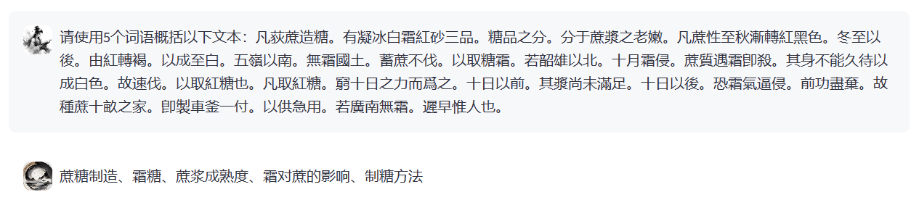
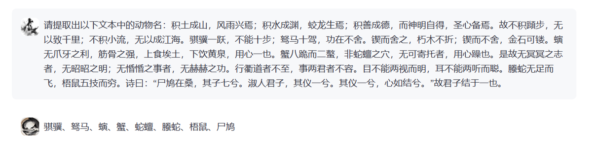
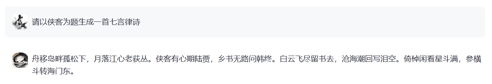
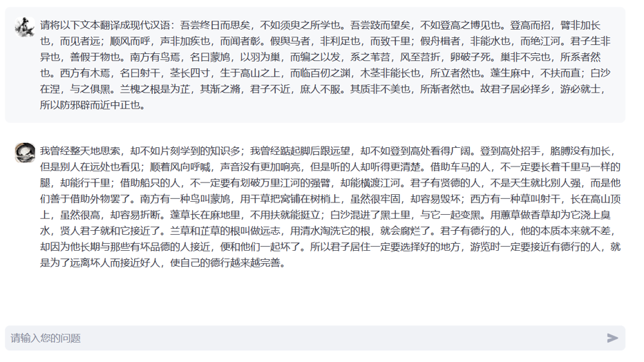
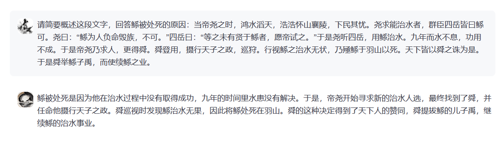
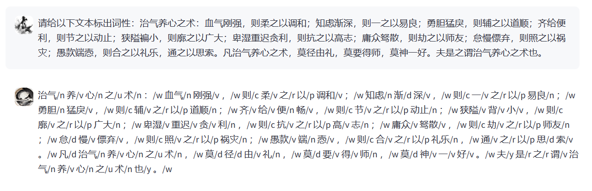
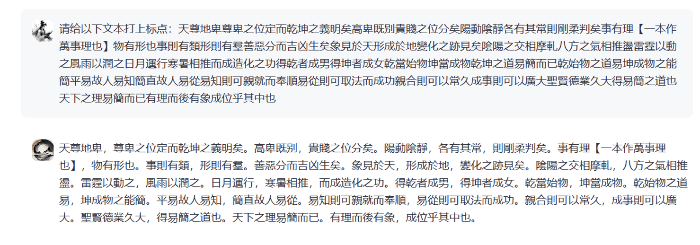

<div align="center">
  
</div>

# XunziALLM

The Xunzi series model open source includes two parts: the base model [**XunziALLM**](https://modelscope.cn/models/Xunzillm4cc/Xunzi-Qwen), as a key focus of this open source model, this project has launched a fully open model for the field of ancient books. At the same time, to facilitate non artificial intelligence professionals to better understand this open source model, we have used some data to construct a dialogue model [**XunziChat**](https://modelscope.cn/models/Xunzillm4cc/Xunzi-Qwen-Chat).Users can call our ancient books processing model using the same method as calling the corresponding open source models such as Qwen, Baichuan2, ChatGLM3, Qwen1.5,etc.

 Currently released ancient books processing models:
 
 | Model Name | Download Link | Corresponding Open Source Model |
 | :----------------------------- | :----------------------------------------------------------- | :--------------------------------|
 |Xunzi-Qwen-7B (base model) | [link](https://modelscope.cn/models/Xunzillm4cc/Xunzi-Qwen) | Qwen-7B base model |
 |Xunzi-Qwen-7B-CHAT (chat model) | [link](https://modelscope.cn/models/Xunzillm4cc/Xunzi-Qwen-Chat) | Qwen-7B chat model |
 |Xunzi-GLM-6B (base model) | [link](https://modelscope.cn/models/Xunzillm4cc/Xunzi-GLM) | ChatGLM3-6B base model |
 |Xunzi-Baichuan-7B (base model) | [link](https://modelscope.cn/models/Xunzillm4cc/Xunzi-Baichuan) | Baichuan2-7B base model |
 |Xunzi-Qwen1.5-4B (base model) | [link](https://modelscope.cn/models/Xunzillm4cc/Xunzi-Qwen1.5-4B) | Xunzi-Qwen1.5-4B base model |
 |Xunzi-Qwen1.5-7B (base model) | [link](https://modelscope.cn/models/Xunzillm4cc/Xunzi-Qwen1.5-7B) | Xunzi-Qwen1.5-7B base model |
 |Xunzi-Qwen1.5-14B (base model) | [link](https://modelscope.cn/models/Xunzillm4cc/Xunzi-Qwen1.5-14B) | Xunzi-Qwen1.5-14B base model |
 |Xunzi-Qwen1.5-7B_chat (chat model) | [link](https://modelscope.cn/models/Xunzillm4cc/Xunzi-Qwen1.5-7B_chat) | Xunzi-Qwen1.5-7B_chat chat model |
 |Xunzi-Qwen2-7B (base model) | [link](https://modelscope.cn/models/Xunzillm4cc/Xunzi-Qwen2-7B) | Xunzi-Qwen2-7B base model |
 |Xunzi-Qwen2-1.5B (base model) | [link](https://modelscope.cn/models/Xunzillm4cc/Xunzi-Qwen2-1.5B) | Xunzi-Qwen2-1.5B base model |
 
 Xunzi-Qwen-7B and Xunzi-Qwen-7B-CHAT are called in the same way as Qwen model.
 
 Xunzi-GLM-6B is called in the same way as ChatGLM3-6B model.
 
 Xunzi-Baichuan-7B is called in the same way as Baichuan2-7B model.

 Xunzi-Qwen1.5-4B，Xunzi-Qwen1.5-14B，Xunzi-Qwen1.5-7B and Xunzi-Qwen1.5-7B_chat are called in the same way as Qwen1.5 model.

 Xunzi-Qwen2-7B and Xunzi-Qwen2-1.5B are called in the same way as Qwen2 model.

## News

- 2024/5/20, the Xunzi-Qwen1.5-7B_chat model’s dialogue API is now freely available. Users can directly invoke the Xunzi-Qwen1.5-7B_chat model for dialogue services through the openai library. The new version of the dialogue model has enhanced a series of functions including information extraction, text translation, and multi-turn dialogue.

- 2024/5/6, the GitHub project’s list of open-source models was updated.
 

## Highlights of Xunzi Series models:

* Intelligent indexing of ancient books, the Xunzi model has powerful ancient book document indexing capabilities and can perform high-quality subject indexing of the content in ancient books, helping researchers quickly understand the topic of the article.


* Ancient book information extraction, the Xunzi model can automatically extract key information from ancient books, such as people, events, locations, etc., which greatly saves researchers time in sorting out information.


* Poetry generation: Xunzi model also has the ability to generate poetry, which can automatically generate ancient poems that comply with grammatical rules and rhyme requirements based on given themes or keywords, providing creative inspiration for poetry lovers.


* High-quality translation of ancient books: For those ancient books that are difficult to understand, the Xunzi model can provide high-quality translation services and help researchers better understand the meaning of the original text.


* Reading comprehension: the Xunzi model can analyze and interpret the given ancient Chinese text and realize automatic reading of ancient text.


* Lexical analysis: Xunzi model can complete automatic word segmentation and part-of-speech tagging of ancient text, which can effectively improve the research efficiency of linguistic workers.


* Automatic punctuation: Xunzi's large model can quickly complete sentence segmentation and punctuation of ancient text, improving the reading experience of ancient text for researchers and amateurs.



Since we also released the base model, users can also use personal training corpus to fine-tune the Xunzi base model according to their own needs, so that it can achieve better processing performance in downstream processing tasks of ancient books.

## API Invocation

Use the third-party Python library openai to call Xunzi-Qwen1.5-7B_chat for dialogue implementation freely.

```python
from openai import OpenAI
from tqdm import tqdm
openai_api_key = "ANY THING"
openai_api_base = "http://xunziallm.njau.edu.cn:21180/v1"
client = OpenAI(
    api_key=openai_api_key,
    base_url=openai_api_base,
)

for i in tqdm(range(0,1)):
    chat_response = client.chat.completions.create(
        model="/home/gpu0/xunzi_web/Xunzi-Qwen1.5-7B_chat",
        messages=[
            {"role": "system", "content": "You are a helpful assistant."},
            {"role": "user", "content": '根据提供的文本，按照关系scheme组合(人物, PO/官職, 官職),(人物, PP/態度傾向/消極, 人物),(人物, PL/其他, 地点),(人物, PL/居, 地点),(人物代词, 態度傾向/消極, 人物)抽取出符合描述的关系三元组\n奏上，上令公卿列侯宗室集議，莫敢難，獨竇嬰爭之，由此與錯有卻。'},
        ]
    )
    print(chat_response.choices[0].message.content)
```

## Statement:

The Xunzi series of large language models have shown good performance in processing information in ancient Chinese texts. They can not only accurately analyze the complexity of ancient texts, but also further explore the rich connotations of traditional Chinese culture. However, we also clearly recognize that there are still many areas for improvement and optimization in this model. Therefore, we warmly welcome and encourage users to provide valuable feedback and suggestions on our model, and in future work, we will launch a new version of the large language model with better performance.

The large number of parameters in large language models also brings more randomness. Although we have tried our best to ensure data compliance when selecting training data, there may still be some unavoidable problems due to the complexity of data and models. Therefore, we will not be held responsible for any issues arising from the use of this open source model, including but not limited to data security issues, public opinion risks, or any risks and issues arising from the model being misled, abused, disseminated, or improperly utilized.

In addition, according to the ["Interim Measures for the Management of Generative Artificial Intelligence Services"](http://www.cac.gov.cn/2023-07/13/c_1690898327029107.htm) jointly issued by the National Cyberspace Administration and seven other departments. When training and using this model, as well as other generative models, please work together in accordance with relevant laws and regulations to build a harmonious, healthy, and sustainable generative artificial intelligence community.

If you have any questions during the use of the model, please feel free to contact us (zhaozhixiao@stu.njau.edu.cn).
